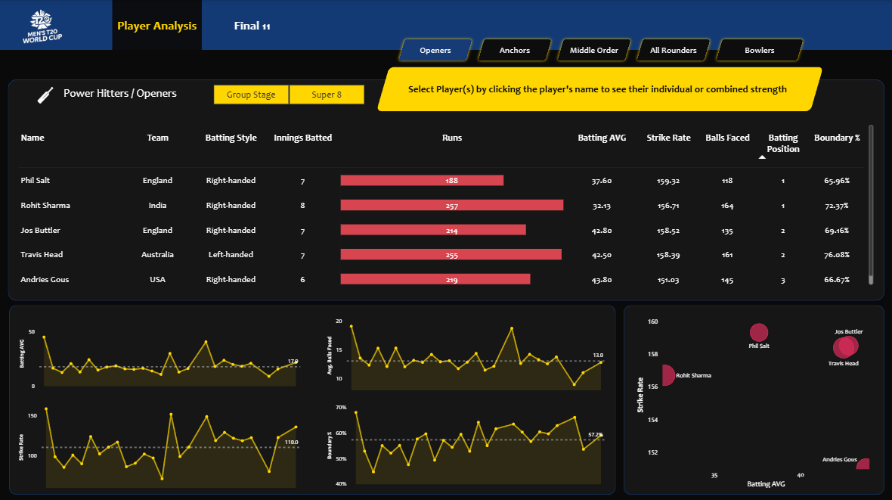

# 🏏 ICC Men’s T20 World Cup 2024 – Cricket Analytics Dashboard

📌 Project Overview
This project is an end-to-end Cricket Analytics solution built using Python and Power BI, focused on data-driven player analysis and team selection for the ICC Men’s T20 World Cup 2024.

The objective of this project is to replace subjective player selection with a transparent, role-based, and performance-driven approach using match-level and ball-by-ball data.

🎯 Business Problem
Player selection in T20 cricket is often influenced by reputation and intuition rather than performance data.
Key questions addressed:
Who are the best players for each role (Openers, Anchors, All-Rounders, Bowlers)?
How do players perform under different match stages (Group vs Super 8)?
What is the optimal Final Playing XI based on combined team performance?

📂 Dataset
Source: Public GitHub repository
Format: CSV
Coverage: 55 matches
Data Files:
Batting data
Bowling data
Match summary
Player information

🛠️ Tools & Technologies
Python (Pandas, Jupyter Notebook)
Power BI
Power Query
DAX

🔄 Data Preparation & Transformation
Loaded raw CSV files into Pandas DataFrames
Cleaned and standardized column names and values
Removed unnecessary columns and string characters
Created a mapping dictionary to generate a match_id column
Exported clean, analysis-ready CSV files for Power BI

⚡ Power Query
Removed duplicates and trimmed text fields
Set proper data types
Created a conditional Match Stage column (Group / Super 8)
Converted Overs → Balls for accurate bowling calculations

🧱 Data Model
The project follows a Star Schema design:

Dimension Tables - 
dim_match_summary
team1, team2, winner, ground, matchDate, stage, match_id
dim_players
team, name, image_url, battingStyle, bowlingStyle, playingRole

Fact Tables -
fact_batting_summary
runs, balls, fours, sixes, strike rate, batting position, boundary runs
fact_bowling_summary
wickets, runs conceded, economy, dot balls, balls bowled, boundary runs

📐 Key Metrics (DAX) : 

🏏 Batting Metrics -
Total Runs
Total Innings Batted
Batting Average
Strike Rate
Boundary Percentage
Average Balls Faced
Batting Position
Total Innings Dismissed
Total Balls Faced

🎯 Bowling Metrics
Total Wickets
Bowling Economy
Bowling Strike Rate
Bowling Average
Dot Ball Percentage
Balls Bowled
Runs Conceded
Total Innings Bowled

🧩 Utility Measures
Dynamic player selection detection
Conditional text & color formatting
Interactive placeholders for better UX

➡️ Total DAX Measures Created: 20

📊 Dashboard Structure

1️⃣ Player Analysis
Five role-based pages with consistent layout and role-specific KPIs:
Openers
Anchors / Top Order
Middle Order / Batting All-Rounders
Lower Order / Bowling All-Rounders
Bowlers
Each page includes:
KPI tables with conditional formatting
Line charts for performance trends
Scatter plots for comparative analysis
Filters for match stage (Group / Super 8)

2️⃣ Final XI Selection
Searchable player slicer
Select any 11 players
Displays:
Selected player profiles
Individual statistics
Combined team performance metrics

🧠 Role-Based Selection Criteria
Role	Key Criteria
Openers	High batting avg, high strike rate, strong boundary %
Anchors	Stability, avg balls faced, consistent scoring
Batting All-Rounders	Batting + limited bowling contribution
Bowling All-Rounders	Bowling impact with lower-order hitting
Bowlers	Economy, strike rate, dot ball %

🧩 Tooltips & UX Enhancements
Custom tooltip pages for:
Batsmen
Bowlers
All-Rounders
Hover-based insights with player image, country, and key stats
Improves insight density without cluttering visuals

📈 Impact & Outcomes
Enables 100% data-driven player comparison
Reduces manual analysis time significantly
Makes team selection transparent, repeatable, and role-focused
Allows quick evaluation of multiple team combinations
Demonstrates strong integration of Python + Power BI + DAX

🚀 Future Enhancements
Predictive player performance modeling
Opponent-specific analysis
Venue-based performance trends
Live match data integration

👤 Author
Vikas Sharma
Aspiring Data Analyst | Power BI | Python | Sports Analytics
